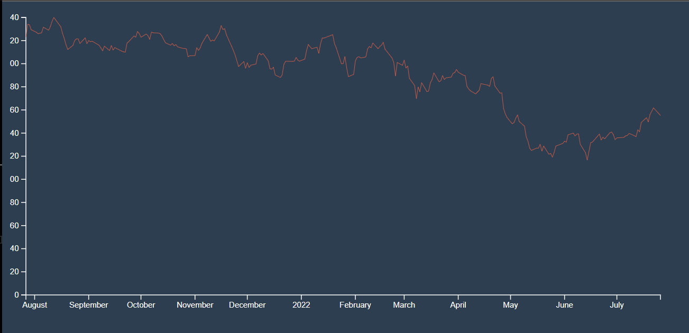

# React and D3
    - Learn d3 with react.
    - Resources included

## Code structure
    - All folder names are in lowercase.
    - All functions, variable names are in camel case.
    - All components are in pascal case.

## Steps
    - Run npx generate-react-cli component followed by name of the compoenent.
    - If you wish to start with a new template delete generate-react-cli.json.

## Charts
    ### Line chart (basic)

    